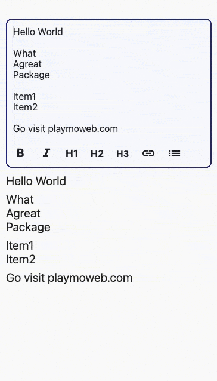
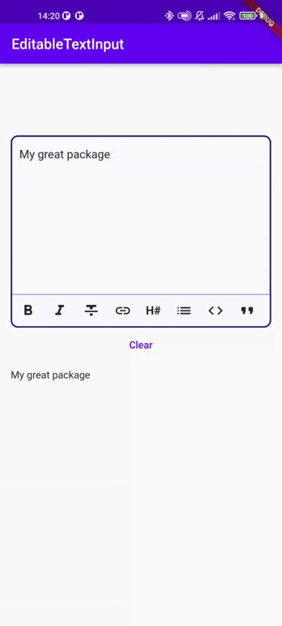

# markdown_editable_textinput

MarkdownEditableTextInput is a TextField Widget that allow you to convert easily what's in the TextField to Markdown.

## Features
- [x] Convert to Bold, Italic, Strikethrough
- [x] Convert to Code, Quote, Links
- [x] Convert to Heading (H1, H2, H3, H4, H5, H6) and Links
- [x] Support text direction
- [x] Dialog mode to enter link and picture
- [x] Possibility to add custom buttons to the action bar

## Demo

### Link by Dialog demo

## Usage
The color of the MarkdownTextInput is defined by the color set in your Theme :
- primaryColor: Cursor's color
- colorScheme.secondary: MarkdownTextInput's borders
- cardColor: Background color of MarkdownTextInput

### Attributes
|            Attributes            |              Example Value               |                             Description                              |
|:--------------------------------:|:----------------------------------------:|:--------------------------------------------------------------------:|
|      Function onTextChanged      |                                          |        Callback used to retrieve the text in parent's Widget         |
|       String initialValue        |              "Lorem Ipsum"               |        Display an initial value in MarkdownTextInput's field         |
|       Function validators        |                                          |               Add validators to the MarkdownTextInput                |
|           String label           |              "Description"               |                 Display a label in MarkdownTextInput                 |
|   TextDirection textDirection    |            TextDirection.rtl             |                        Change text direction                         |
|           int maxLines           |                    3                     |        The maximum of lines that can be display in the input         |
|    List<MarkdownType> actions    | [MarkdownType.bold, MarkdownType.italic] |                    Actions the editor will handle                    |
| TextEditingController controller |         TextEditingController()          | Pass your own controller. Can be used to clear the input for example |
|       TextStyle textStyle        |  Theme.of(context).textTheme.bodyText2   |                      Overrides input text style                      |
|    bool insertLinksByDialog;     |                   true                   |              Choose to use dialog or not to insert link              |
|    bool insertImageByDialog;     |                   true                   |            Choose to use dialog or not to insert an image            |
|    bool insertImageByDialog;     |                   true                   |            Choose to use dialog or not to insert an image            |
|   bool customCancelDialogText;   |                 String?                  |             Text used by dialog for close dialog action              |
|   bool customSubmitDialogText;   |                 String?                  |            Text used by dialog for validate dialog action            |

### Example
You can see an example of how to use this package [here](https://github.com/playmoweb/markdown-editable-textinput/tree/master/example)

